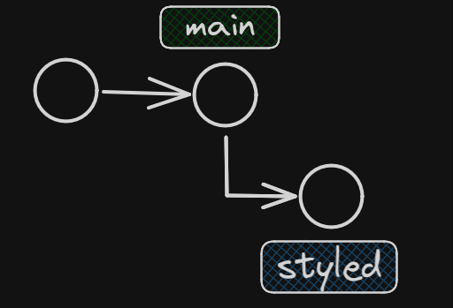

- Para el paso **11** utilice el comando `git reset --hard HEAD~1`. Lo hice de esta manera ya que solamente tenia 1 unico archivo en mi Working Copy y me resultaba mas 'practico' que hacerlo en dos comandos con el *git reset* y luego *git restore*

- Para el paso **12**, con `git reflog`, me fíjo en el commit que acabamos de deshacer y con el token vuelvo al mismo con el comando `git reset --HARD 25d535a`

- En el paso **13** la rama *styled* ya contiene a *main*, por ser *main* ancestro de *styled*. Por eso no es posible hacer el *merge*

- El merge del paso **19** si tenia conflictos por resolver ya que lo que las dos ramas contenian cambios distintos dentro del mismo fichero, y en las mismas lineas, haciendo que entre en conflicto

- El merge del paso **21** no causo conflictos y realizo un merge por la estrategia *ort*

- Para dibujar el diagrama en que se pedia en el paso 15 utilice el comando `git log --graph`

- El merge del paso **26** podría ser FF. Esto se debe a que git detecta que donde escribimos el titulo no habia nada anteriormente

- Para deshacer el merge sin perder los cambios utilizo el comando `git reset HEAD ~1`

- Para perder los cambios como lo pide el paso **28** utilizo el comando `git restore git-nuestro.md`

- Con el comando `git branch -D title` podemos eliminar la rama. Tuve que agregar el modificador *-D* para forzar el delet, ya que git detectaba que habia cambios que no estaban fusionados en la raman main (por haber desecho el merge)

- Para rehacer el merge, como lo pide el paso **30**, podremos usar el comando `git merge <ID COMMIT>` (en mi caso `git merge 184b1b4`). De este modo no necesitamos volver a crear la rama title ya que, pése a eliminarla, el commit persiste en git

- Para volver al commit inicial hacemos `git reset --hard c9ca78b`

- Posicionado en el commit inicial si quicieramos volver al commit donde agregamos el titulo hacemos `git reset --hard 184b1b4`